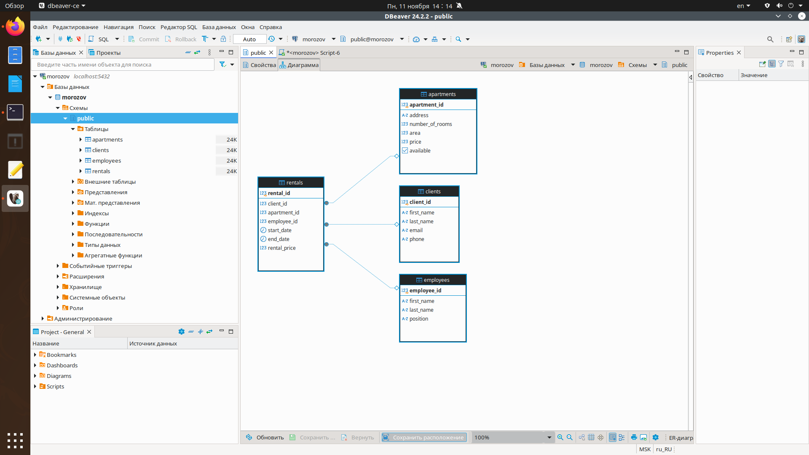

# Курсовая работа

**Тема:** База данных агентства по аренде квартир.

**Студент:** Морозов Николай Константинович.

**Группа:** 414.

# Содержание

- [Введение](#введение)
- [Анализ предметной области](#анализ-предметной-области)
- [Инфологическая модель базы данных](#инфологическая-модель-базы-данных)
- [Логическая структура базы данных](#логическая-структура-базы-данных)
- [Физическая структура базы данных](#физическая-структура-базы-данных)
- [Реализация проекта в СУБД](#реализация-проекта-в-субд)
- [Заключение](#заключение)
- [Список использованных источников](#список-использованных-источников)


# Введение

## Актуальность
В современных условиях городской жизни спрос на аренду жилья стабильно увеличивается, особенно в крупных мегаполисах и студенческих городках. Этот рост связан с рядом социально-экономических факторов, таких как урбанизация, мобильность населения, высокая стоимость покупки недвижимости и спрос на временное проживание. Рынок аренды жилья становится всё более конкурентным, а запросы клиентов — более индивидуальными и разнообразными. Агентствам по аренде квартир необходимо обрабатывать значительные объемы данных о клиентах, квартирах, условиях аренды, а также отслеживать процессы взаимодействия между клиентами и сотрудниками агентства.

С развитием информационных технологий базы данных стали важным инструментом для систематизации, анализа и хранения информации. Для агентства по аренде квартир эффективное использование базы данных позволяет автоматизировать большинство процессов, связанных с управлением данными, что, в свою очередь, значительно ускоряет процессы поиска и подбора жилья для клиентов. Применение базы данных позволяет минимизировать ошибки, сократить время обработки запросов, улучшить качество обслуживания, а также обеспечить прозрачность и актуальность информации. Таким образом, актуальность разработки базы данных для агентства по аренде квартир заключается не только в повышении эффективности работы агентства, но и в улучшении опыта клиентов, что способствует росту их удовлетворенности и лояльности.


## Цель
Целью данной работы является создание базы данных, которая будет включать в себя хранение информации о клиентах, квартирах, аренде и сотрудниках агентства. Данная база данных должна стать основным инструментом для систематического и эффективного управления данными, касающимися аренды жилья, что позволит агентству более точно и быстро выполнять запросы клиентов.

## Задачи
Для достижения поставленной цели необходимо выполнить следующие задачи:

1. Проанализировать требования к базе данных для агентства по аренде квартир, определить ключевые процессы, которые должны быть автоматизированы, и необходимые категории данных.
2. Разработать структуру базы данных, включающую таблицы и связи, которые будут поддерживать хранение и обработку информации о клиентах, объектах аренды, договорах аренды и сотрудниках агентства.
3. Реализовать таблицы и установить отношения между ними для эффективного управления данными в соответствии с функциональными требованиями агентства.


 ## 1. Анализ предметной области. Постановка задачи

### 1.1. Описание предметной области и функции решаемых задач
Предметной областью является аренда квартир в агентствах недвижимости. Система решает задачи регистрации клиентов, сотрудников и квартир, управления арендами, а также отслеживания доступных квартир. Система позволяет агентам и клиентам взаимодействовать для поиска жилья, оформления аренды и управления арендными договорами.

### 1.2. Перечень входных данных
- Данные клиентов: имя, фамилия, контактные данные.
- Данные квартир: адрес, количество комнат, площадь, цена, доступность.
- Данные сотрудников: ФИО, должность.
- Данные аренды: клиент, квартира, срок аренды, стоимость.

### 1.3. Перечень выходных данных
- Список доступных квартир.
- История арендных сделок.
- Статистика по аренде.

### 1.4. Ограничения предметной области
- Аренда доступна только для свободных квартир.
- Система ограничивает доступ к данным сотрудников.
- Сроки аренды могут быть ограничены договорными условиями.


## 2. Инфологическая (концептуальная) модель базы данных

### 2.1. Выделение информационных объектов
Основными информационными объектами в системе аренды квартир являются:
- **Клиенты**: люди, которые арендуют квартиры.
- **Квартиры**: объекты недвижимости, которые сдаются в аренду.
- **Аренда**: отношения между клиентами и квартирами, фиксирующие аренду.
- **Сотрудники**: работники агентства, которые управляют арендами и клиентами.

### 2.2. Определение атрибутов объектов
- **Клиенты**: ID клиента, имя, фамилия, email, телефон.
- **Квартиры**: ID квартиры, адрес, количество комнат, площадь, цена, доступность.
- **Аренда**: ID аренды, ID клиента, ID квартиры, дата начала, дата окончания, цена аренды.
- **Сотрудники**: ID сотрудника, имя, фамилия, должность.

### 2.3. Определение отношений и мощности отношений между объектами
- **Клиенты - Аренда**: Один клиент может арендовать несколько квартир, но каждая аренда связана только с одним клиентом (1:N).
- **Квартиры - Аренда**: Каждая квартира может быть арендована несколько раз, но каждая аренда связана с одной квартирой (1:N).
- **Сотрудники - Аренда**: Один сотрудник может управлять несколькими арендами, но каждая аренда фиксируется только одним сотрудником (1:N).

### 2.4. Построение концептуальной модели


## 3. Реализация проекта в среде конкретной СУБД 

Проект реализуется в среде **PostgreSQL**. 

---

### 3.1. Создание таблиц

Для начала создадим необходимые таблицы для хранения информации о клиентах, квартирах, сотрудниках и договорах аренды. Пример SQL-запросов:

```sql
-- Создание таблицы клиентов
CREATE TABLE Clients (
    client_id SERIAL PRIMARY KEY,
    first_name VARCHAR(50) NOT NULL,
    last_name VARCHAR(50) NOT NULL,
    email VARCHAR(100),
    phone VARCHAR(15)
);

-- Создание таблицы квартир
CREATE TABLE Apartments (
    apartment_id SERIAL PRIMARY KEY,
    address VARCHAR(255) NOT NULL,
    number_of_rooms INT,
    area INT,
    price INT NOT NULL,
    available BOOLEAN DEFAULT TRUE
);

-- Создание таблицы сотрудников
CREATE TABLE Employees (
    employee_id SERIAL PRIMARY KEY,
    first_name VARCHAR(50),
    last_name VARCHAR(50),
    position VARCHAR(50)
);

-- Создание таблицы аренды
CREATE TABLE Rentals (
    rental_id SERIAL PRIMARY KEY,
    client_id INT,
    apartment_id INT,
    employee_id INT,
    start_date DATE,
    end_date DATE,
    rental_price INT,
    FOREIGN KEY (client_id) REFERENCES Clients(client_id),
    FOREIGN KEY (apartment_id) REFERENCES Apartments(apartment_id),
    FOREIGN KEY (employee_id) REFERENCES Employees(employee_id)
);
```

Каждая из этих таблиц имеет свои атрибуты:

Clients — информация о клиентах, включая имя, фамилию, email и телефон.

Apartments — данные о квартирах, такие как адрес, количество комнат, площадь и стоимость аренды.

Employees — данные о сотрудниках агентства, их должности и имена.

Rentals — данные о заключенных договорах аренды, ссылаются на клиента, квартиру и сотрудника, который оформил аренду.


### 3.2. SQL-запросы PostgreSQL для базы данных агентства аренды квартир
Запросы к базе данных агентства аренды квартир играют ключевую роль в обеспечении эффективного управления данными, автоматизации процессов и поддержки бизнес-операций агентства. Используя SQL-запросы, можно выполнять различные действия, такие как добавление, изменение, удаление данных и их анализ. В рамках данной базы данных запросы позволяют:

Управлять информацией о клиентах, квартирах, сотрудниках и аренде: добавлять новых клиентов и сотрудников, обновлять данные о квартирах и договорах аренды.
Получать актуальные данные для анализа и отчетности: получать информацию о доступных квартирах, завершенных арендах, выручке и статистике по аренде.
Поддерживать порядок и точность данных: обновлять или удалять устаревшие данные, такие как истекшие договоры аренды или недействительные контактные данные.
Обеспечить доступ к критически важным данным для принятия решений: с помощью запросов сотрудники агентства могут быстро найти подходящие квартиры для аренды, отслеживать занятость, устанавливать цены и анализировать рыночные тенденции.
Эти запросы позволяют автоматизировать управление базой данных и поддерживать высокую эффективность работы агентства.

```sql
-- 1. Добавление нового клиента
INSERT INTO Clients (first_name, last_name, email, phone)
VALUES ('Анна', 'Смирнова', 'anna.smirnova@example.com', '+79123456789');

-- 2. Добавление новой квартиры
INSERT INTO Apartments (address, number_of_rooms, area, price, available)
VALUES ('ул. Пушкина, д. 10', 2, 55, 30000, TRUE);

-- 3. Добавление нового сотрудника
INSERT INTO Employees (first_name, last_name, position)
VALUES ('Сергей', 'Иванов', 'Менеджер');

-- 4. Создание новой записи об аренде
INSERT INTO Rentals (client_id, apartment_id, employee_id, start_date, end_date, rental_price)
VALUES (1, 2, 1, '2024-11-01', '2025-11-01', 30000);

-- 5. Обновление информации о клиенте
UPDATE Clients SET email = 'new_email@example.com' WHERE client_id = 1;

-- 6. Обновление стоимости аренды квартиры
UPDATE Apartments SET price = 35000 WHERE apartment_id = 2;

-- 7. Удаление записи о клиенте
DELETE FROM Clients WHERE client_id = 5;

-- 8. Удаление записи о квартире
DELETE FROM Apartments WHERE apartment_id = 3;

-- 9. Поиск всех квартир с ценой аренды ниже 30000
SELECT * FROM Apartments WHERE price < 30000;

-- 10. Поиск всех клиентов с указанием email
SELECT * FROM Clients WHERE email IS NOT NULL;

-- 11. Получение всех доступных квартир
SELECT * FROM Apartments WHERE available = TRUE;

-- 12. Поиск клиентов, арендующих квартиры через определенного менеджера
SELECT c.first_name, c.last_name FROM Rentals r
JOIN Clients c ON r.client_id = c.client_id
WHERE r.employee_id = 1;

-- 13. Изменение доступности квартиры
UPDATE Apartments SET available = FALSE WHERE apartment_id = 1;

-- 14. Получение списка всех квартир по убыванию цены
SELECT * FROM Apartments ORDER BY price DESC;

-- 15. Подсчет общего количества клиентов
SELECT COUNT(*) FROM Clients;

-- 16. Подсчет количества занятых квартир
SELECT COUNT(*) FROM Apartments WHERE available = FALSE;

-- 17. Суммарная выручка от всех договоров аренды
SELECT SUM(rental_price) FROM Rentals;

-- 18. Средняя стоимость аренды квартир
SELECT AVG(price) FROM Apartments;

-- 19. Вывод всех договоров аренды, заканчивающихся в текущем месяце
SELECT * FROM Rentals WHERE end_date BETWEEN '2024-11-01' AND '2024-11-30';

-- 20. Обновление должности сотрудника
UPDATE Employees SET position = 'Старший менеджер' WHERE employee_id = 1;

-- 21. Поиск квартир с площадью более 70 кв.м
SELECT * FROM Apartments WHERE area > 70;

-- 22. Поиск всех сотрудников с должностью "Менеджер"
SELECT * FROM Employees WHERE position = 'Менеджер';

-- 23. Удаление всех договоров аренды, срок которых истек
DELETE FROM Rentals WHERE end_date < CURRENT_DATE;

-- 24. Установка скидки на аренду для конкретной квартиры
UPDATE Apartments SET price = price * 0.9 WHERE apartment_id = 2;

-- 25. Получение списка всех клиентов с сортировкой по фамилии
SELECT * FROM Clients ORDER BY last_name;

-- 26. Сотрудники, имеющих хотя бы 1 договор
SELECT DISTINCT e.first_name, e.last_name
FROM Employees e
JOIN Rentals r ON e.employee_id = r.employee_id
WHERE r.end_date >= CURRENT_DATE;

-- 27. Изменение номера телефона клиента
UPDATE Clients SET phone = '+79111234567' WHERE client_id = 1;

-- 28. Добавление нового договора аренды с текущей датой начала
INSERT INTO Rentals (client_id, apartment_id, employee_id, start_date, end_date, rental_price)
VALUES (2, 3, 1, CURRENT_DATE, '2025-11-01', 40000);

-- 29. Подсчет количества договоров аренды по каждому клиенту
SELECT client_id, COUNT(*) AS rental_count
FROM Rentals
GROUP BY client_id;

-- 30. Поиск всех сотрудников, связанных с определенными договорами аренды
SELECT DISTINCT e.first_name, e.last_name FROM Employees e
JOIN Rentals r ON e.employee_id = r.employee_id;
```

# Заключение
В результате выполнения курсовой работы была разработана и реализована база данных для агентства по аренде квартир. Проанализирована предметная область, определены основные объекты и связи между ними, а также создана концептуальная модель данных. Реализация базы данных с помощью СУБД PostgreSQL позволила организовать структуру хранения информации о клиентах, квартирах, аренде и сотрудниках. База данных автоматизирует ключевые бизнес-процессы агентства: управление информацией о квартирах и аренде, взаимодействие с клиентами и сотрудниками, а также обработку запросов. Создание и тестирование SQL-запросов продемонстрировало возможности системы для получения аналитических данных, что повышает эффективность управления агентством и способствует развитию бизнеса.

 # Список использованных источников

 Корбут А.А. Основы проектирования баз данных. Учебное пособие. — М.: Издательство МГТУ, 2020. 
 
 Официальная документация PostgreSQL. https://www.postgresql.org/docs/


